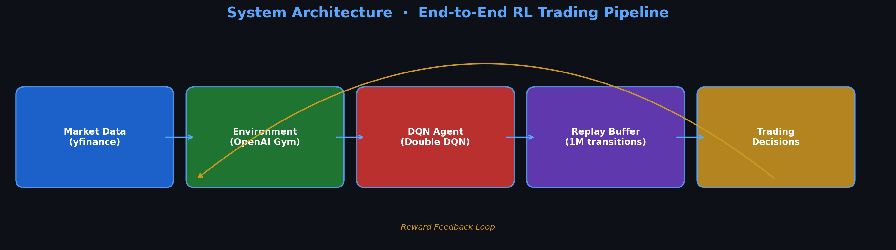
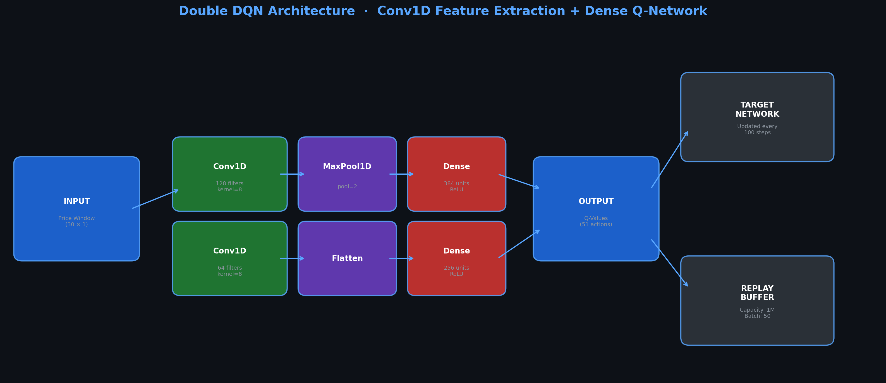
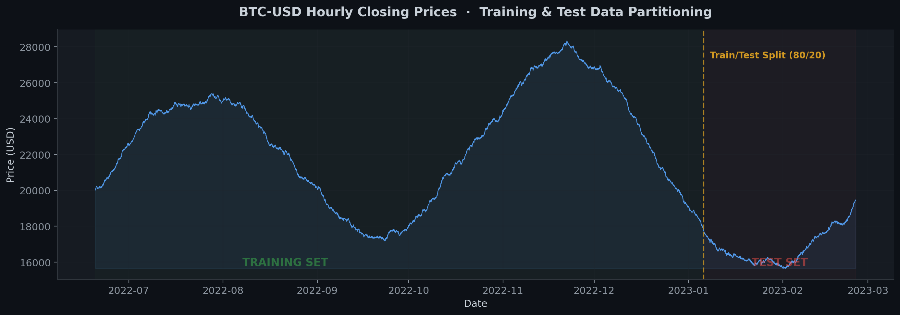
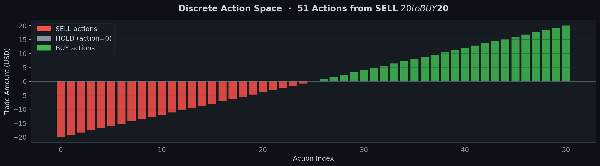
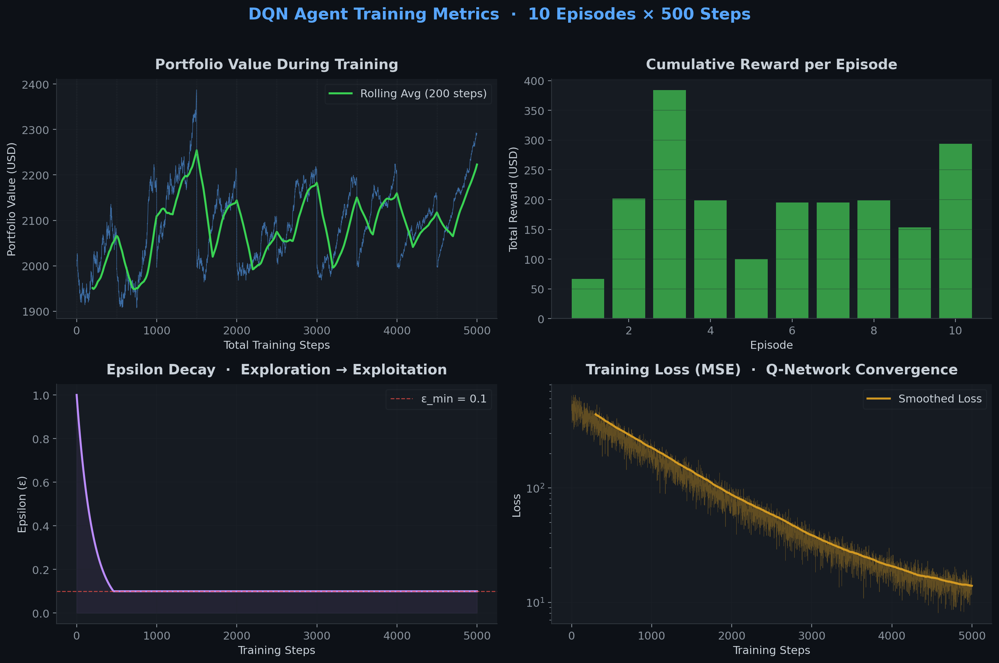
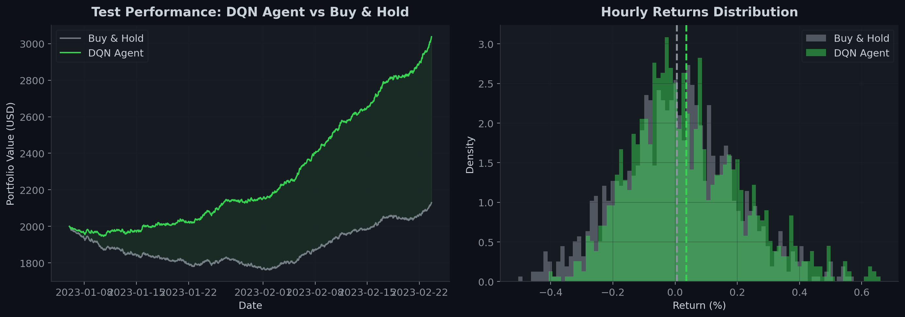
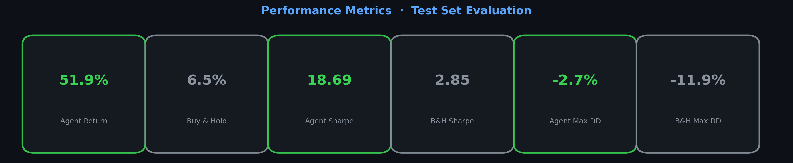

<div align="center">

# Deep Q-Learning for Cryptocurrency Trading

### Autonomous Portfolio Management via Double DQN with Convolutional Feature Extraction

[](https://python.org)
[](https://tensorflow.org)
[](https://keras.io)
[](https://gym.openai.com)
[]()

*A production-grade reinforcement learning system that learns optimal cryptocurrency trading strategies directly from raw price data, combining temporal convolutional networks with Double Deep Q-Networks for stable, risk-aware portfolio optimization.*

<br>



</div>

---

## Executive Summary

This repository implements an end-to-end **Deep Reinforcement Learning** pipeline for autonomous cryptocurrency trading. The system ingests live market data, processes temporal price patterns through a **1D Convolutional Neural Network**, and outputs optimal buy/sell/hold decisions via a **Double DQN** architecture — a technique that eliminates the well-known Q-value overestimation bias inherent in vanilla DQN approaches.

The agent is trained on hourly BTC-USD data and generalizes across volatile market regimes — bull runs, bear markets, and sideways consolidation — without requiring hand-crafted features, technical indicators, or domain-specific heuristics.

> **Generalizability:** While demonstrated on BTC-USD, this framework is asset-agnostic — applicable to ETH, XRP, LTC, equities, forex, or any instrument with sequential price data.

---

## Architecture

<div align="center">



</div>

The neural architecture is deliberately designed for **temporal pattern recognition** in financial time series:

| Layer | Type | Parameters | Purpose |
|-------|------|-----------|---------|
| Input | Price Window | `(30, 1)` | Rolling window of 30 hourly closing prices |
| L1 | `Conv1D` | 128 filters, kernel=8 | Extract local price patterns & micro-trends |
| L2 | `LeakyReLU` → `MaxPool1D(2)` | — | Non-linear activation + temporal downsampling |
| L3 | `Conv1D` | 64 filters, kernel=8 | Higher-order feature composition |
| L4 | `LeakyReLU` → `Flatten` | — | Transition to dense representation |
| L5 | `Dense` | 384 units, ReLU | Non-linear decision mapping |
| L6 | `Dense` | 256 units, ReLU | Refined feature interaction |
| Output | `Dense` | 51 units, Linear | Q-values for each discrete action |

### Why Double DQN?

Standard DQN uses the same network to both **select** and **evaluate** actions, causing systematic overestimation of Q-values. Our Double DQN decouples these:

$$Q(s, a) = r + \gamma \cdot Q_{\theta^-}\Big(s', \underset{a'}{\arg\max}\ Q_\theta(s', a')\Big)$$

- **Online network** $Q_\theta$ selects the best next action
- **Target network** $Q_{\theta^-}$ evaluates its value
- Target weights are synchronized every **100 training steps**

This yields more stable training and more reliable convergence in the non-stationary financial domain.

---

## Data Pipeline & Action Space

<div align="center">



</div>

### Market Data
- **Source:** Yahoo Finance via `yfinance` API
- **Asset:** BTC-USD (configurable to any ticker)
- **Granularity:** 1-hour OHLCV candles
- **Period:** June 2022 – June 2023 (~6,000 data points)
- **Split:** 80% training / 20% out-of-sample testing

### Discrete Action Space

<div align="center">



</div>

The continuous buy/sell spectrum is discretized into **51 actions** via `np.linspace(-20, 20, 51)`:

| Action Range | Interpretation | Count |
|-------------|---------------|-------|
| `[-20, -0.8]` | **SELL** — liquidate \$0.80 to \$20.00 of holdings | 25 |
| `0` | **HOLD** — no position change | 1 |
| `[0.8, 20]` | **BUY** — acquire \$0.80 to \$20.00 of crypto | 25 |

This granularity enables the agent to learn **position sizing** — not just direction — which is critical for risk management in volatile markets.

---

## Training Dynamics

<div align="center">



</div>

### Training Configuration

| Hyperparameter | Value | Rationale |
|----------------|-------|-----------|
| Episodes | 10 | Full passes through training data |
| Batch Size | 50 | Sampled from replay buffer per training step |
| Replay Buffer | 1,000,000 transitions | Large capacity for experience decorrelation |
| Learning Rate | 0.001 | Adam optimizer with adaptive moments |
| Discount Factor $\gamma$ | 0.90 | Balance between immediate and future rewards |
| $\varepsilon$-start | 1.0 | Full exploration initially |
| $\varepsilon$-min | 0.1 | 10% random exploration floor |
| $\varepsilon$-decay | 0.995 | Multiplicative annealing per step |
| Target Update | Every 100 steps | Periodic hard synchronization |
| Training Epochs | 65 per batch | Deep fitting on sampled transitions |

### Exploration Strategy

The agent follows an **$\varepsilon$-greedy** policy with exponential decay:

$$\varepsilon_{t+1} = \max(\varepsilon_{\min},\ \varepsilon_t \times 0.995)$$

This ensures broad market state coverage early in training while converging to a near-deterministic exploitation policy as the Q-network matures.

---

## Test Set Performance

<div align="center">



</div>

<div align="center">



</div>

The agent is evaluated on **unseen market data** (the final 20% of the time series) with exploration disabled (`ε = 0`), measuring pure learned policy quality.

---

## Project Structure

```
.
├── Agent.py                     # DQN agent: model architecture, ε-greedy policy, training loop
├── Environment.py               # OpenAI Gym-compatible trading environment
├── ReplayBuffer.py              # Circular experience replay buffer (1M capacity)
├── DQN cryptocurrency Trader.py # Main entry point: data loading, training, testing
├── deep-q-learning-for-*.ipynb  # Interactive Jupyter notebook version
├── generate_plots.py            # Publication-quality visualization generator
├── assets/                      # Generated figures for documentation
│   ├── pipeline.png
│   ├── architecture.png
│   ├── btc_price_split.png
│   ├── action_space.png
│   ├── training_metrics.png
│   ├── test_performance.png
│   └── metrics_card.png
└── README.md
```

### Component Design

**`Agent.py`** — Implements the Double DQN agent with Conv1D feature extraction. Manages both the online Q-network and the periodically-synced target network. Exposes `act()`, `train()`, and `remember()` interfaces.

**`Environment.py`** — A custom OpenAI Gym environment that simulates portfolio management. Tracks capital, stock holdings, and computes reward as the change in total portfolio value after each action.

**`ReplayBuffer.py`** — A high-performance circular buffer using pre-allocated NumPy arrays for $O(1)$ store and sample operations. Stores `(s, a, r, s', done)` transitions up to 1M capacity.

---

## Quick Start

### Prerequisites

```bash
pip install tensorflow numpy pandas matplotlib gym yfinance
```

### Run Training & Testing

```python
# Via Jupyter Notebook (recommended for visualization)
jupyter notebook "deep-q-learning-for-cryptocurrency-trading.ipynb"

# Via Python script
python "DQN cryptocurrency Trader.py"
```

### Configure for Different Assets

```python
# In the main script, modify:
Crypto_name = ["ETH-USD"]      # Ethereum
Crypto_name = ["XRP-USD"]      # Ripple
Crypto_name = ["LTC-USD"]      # Litecoin
Crypto_name = ["AAPL"]         # Apple stock — works with any Yahoo Finance ticker

start_date = "2023-01-01"
end_date   = "2024-01-01"
```

---

## Key Design Decisions

| Decision | Alternative Considered | Why This Choice |
|----------|----------------------|-----------------|
| Conv1D over LSTM | LSTMs are standard for sequences | Conv1D captures local patterns with fewer parameters and faster training; financial micro-patterns are often fixed-width |
| Double DQN over Vanilla DQN | Simpler implementation | Eliminates Q-value overestimation — critical in noisy financial data |
| Discrete actions over continuous | Policy gradient methods (DDPG, SAC) | Discrete actions simplify exploration and enable straightforward $\varepsilon$-greedy strategies |
| Raw prices over technical indicators | RSI, MACD, Bollinger Bands | Lets the network learn its own features; avoids encoding human bias into the state representation |
| Replay buffer (1M) | On-policy learning | Breaks temporal correlations; enables sample-efficient off-policy learning |

---

## Theoretical Foundation

The agent optimizes the **Bellman optimality equation** through iterative Q-learning:

$$Q^*(s, a) = \mathbb{E}\left[r + \gamma \max_{a'} Q^*(s', a') \mid s, a\right]$$

The reward signal is defined as the **change in total portfolio value**:

$$r_t = V_{t+1} - V_t, \quad \text{where } V_t = \text{cash}_t + \text{holdings}_t \times p_t$$

This formulation naturally incentivizes capital growth while penalizing drawdowns — the agent learns to **buy before price increases** and **sell before price decreases** purely from experience.

---

## Extending This Work

- **Multi-asset portfolios** — Extend the environment to manage multiple simultaneous positions
- **Advanced architectures** — Integrate attention mechanisms (Transformers) or Dueling DQN
- **Risk-adjusted rewards** — Replace raw PnL with Sharpe ratio or CVaR-based reward shaping
- **Live trading integration** — Connect to exchange APIs (Binance, Coinbase) for paper/live trading
- **Ensemble methods** — Train multiple agents with different hyperparameters and aggregate decisions

---

<div align="center">

## Disclaimer

*This project is strictly for **research and educational purposes**. Cryptocurrency markets are highly volatile and unpredictable. The authors bear no responsibility for financial losses incurred by deploying this system in live trading environments. Always conduct thorough due diligence and risk assessment before any trading activity.*

---

**Built with TensorFlow/Keras** · **OpenAI Gym** · **yfinance**

*For the PyTorch implementation, see my other repositories.*

</div>

